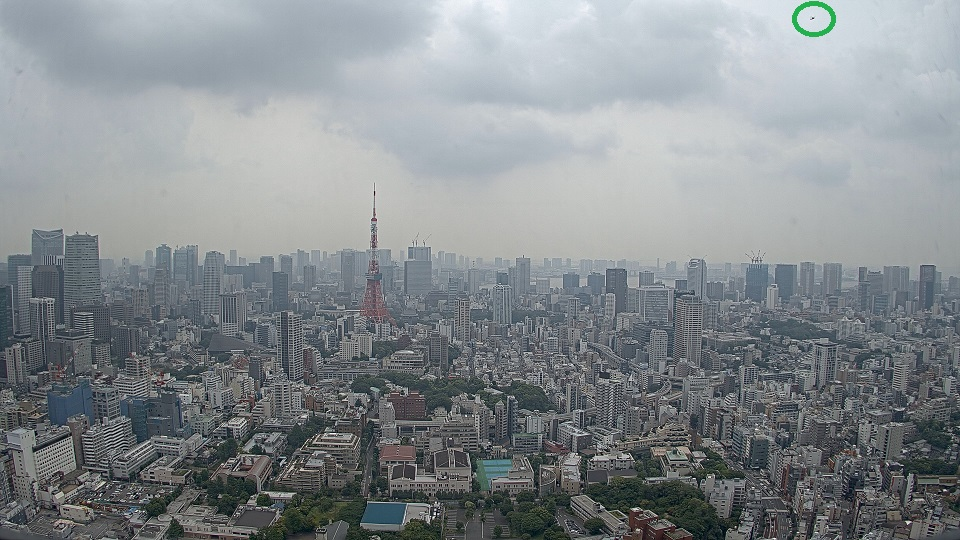

 

  <h3 align="center">The Flying Object Dataset</h3>
  

  

    The flying object dataset contains more than one thousand annotations of flying objects in more than 1,630 images. The images in the dataset were collected with a camera installed on the 42nd floor of Roppongi Hills in Tokyo. The development of the dataset was realized with the cooperation of Mori Building Co., Ltd.. Here is our published paper in Sensors:
     
    <a href="https://doi.org/10.3390/s20247071"><strong>Sky Monitoring System for Flying Object Detection Using 4K Resolution Camera, Sensors, 2020</strong> </a>

## Annotation style
All flying objects in the flying object dataset are labeled with object class (three categories).

Please note that the annotations are provided in `YOLO` format style ([darknet](https://github.com/AlexeyAB/darknet)). There is a `.txt`-file for each `.jpg`-image-file - in the same directory and with the same name. Each line contains the class and bounding box coordinates for a flying object in the image. If there are multiple flying objects in the image, the number of lines will increase accordingly.

`<object-class> <x_center> <y_center> <width> <height>`

where:

object-class: 0:bird (74 annotations), 1:heli (1,392 annotations), 2:airplane (190 annotations)

## Download Dataset

- [Download]()

<!-- LICENSE -->
## License

Distributed under the MIT License. See `LICENSE.txt` for more information.

<!-- CONTACT -->
## Contact

For any question and support, please create an issue on GitHub or write to the author here:

Sekimoto lab.  - sekimoto[at]csis.u-tokyo.ac.jp

(<a href="#top">Back to top</a>)

